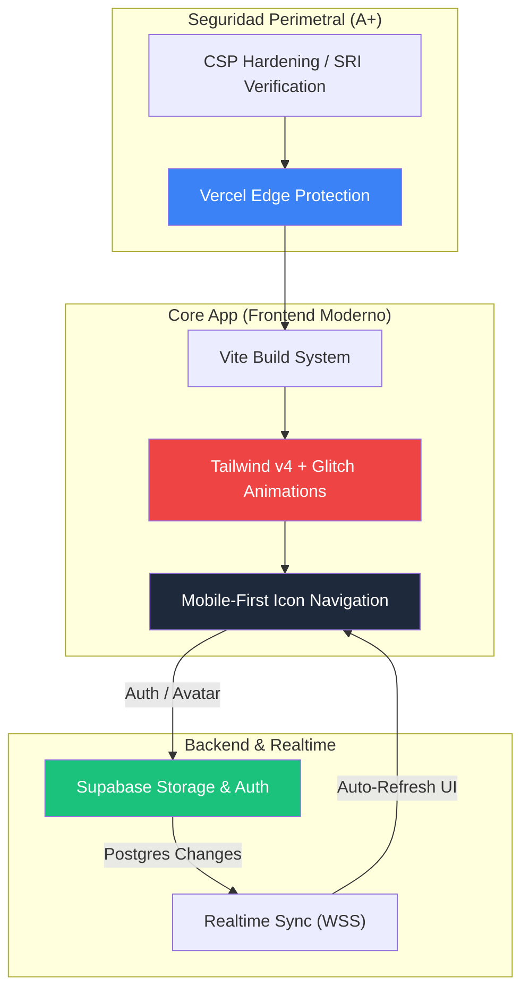

# 🏆 Informe Técnico Ejecutivo Unificado: Prode Mundial 2026

**Fecha de Última Actualización:** 15 de abril de 2026  
**Tipo de Proyecto:** Plataforma de Predicciones Deportivas Corporativa (Vittal Edition) con Módulo de Emergencias Médicas.  
**Estado:** **PRODUCCIÓN FINAL ESTABLE** (Desplegado en [sapate.net.ar](https://sapate.net.ar))  
**Seguridad:** **Grado A+ Confirmado** (Hardening de CSP y SRI completo)

---

## ⏱️ Métricas de Desarrollo Actualizadas (Hito Final)
El proyecto ha completado su fase de pulido y optimización de experiencia de usuario, alcanzando su madurez técnica:

- **Días calendario involucrados:** 17 días (30 de marzo a 15 de abril).
- **Esfuerzo Total Acumulado:** ~50 horas de desarrollo efectivo.
- **Estado de Infraestructura:** 100% Serverless (Vercel + Supabase) sin costes fijos de mantenimiento.

---

## 🚀 Actualizaciones Críticas de la Fase Final (Abril 13-15)

### 1. 🎁 Módulo de Incentivos: Sistema de Premios "Glitch"
Se implementó una sección de premios para incentivar la participación masiva:
- **Banner de Premios Sorpresa**: Integración de un contenedor dinámico en el Ranking General que revela los premios (1° al 5° puesto).
- **Estética Cyberpunk**: Aplicación de un **efecto visual Glitch** mediante animaciones CSS `keyframes` y pseudo-elementos, dotando a la interfaz de una identidad visual moderna y tecnológica.
- **Control de Visibilidad**: Toggle interactivo mediante JS modular para mantener la limpieza de la UI.

### 2. 📱 Overhaul de Experiencia Móvil (UX/UI)
Rediseño completo de la navegación en dispositivos móviles siguiendo las buenas prácticas de diseño de Google:
- **Navegación por Iconos Vectoriales**: Sustitución de etiquetas de texto por una botonera de iconos (Balón, Trofeo, Usuarios) para maximizar el espacio útil.
- **Optimización de Verticalidad**: Corrección de la alineación de contenedores (Flex Start) y reset automático de scroll al tope (`window.scrollTo`) al cambiar de vista, eliminando errores de centrado vertical que afectaban la lectura en pantallas pequeñas.
- **Iconografía Consistente**: Uso de la librería **Phosphor Icons (Bold)** para garantizar uniformidad en pesos visuales y tiempos de carga.

### 3. 🛡️ Refuerzo de Seguridad y Estabilidad (A+)
Se resolvieron los últimos bloqueos de seguridad detectados en navegadores estrictos:
- **Resolución de CSP (Avatares)**: Ajuste de directivas `img-src` para permitir la carga segura de fotos de perfil desde buckets de Supabase Storage.
- **Implementación de SRI (Subresource Integrity)**: Aplicación de hashes criptográficos (`sha384`) en la carga de scripts externos (Phosphor Icons), previniendo ataques de alteración de librerías en tránsito.
- **Validación de Datos**: Límite estricto de 25 goles por predicción para evitar desbordamientos visuales o errores lógicos en el simulador de puntajes.

---

## 🛠️ Arquitectura de Servicios y Sincronismo

---

## 🏁 Conclusión de Etapa
La plataforma **Prode Mundial 2026** se encuentra en un estado de **Calidad Tier-1**. No solo cumple con los requisitos funcionales de predicciones y ranking en tiempo real, sino que supera los estándares de seguridad modernos de la web, ofreciendo una experiencia rápida, visualmente impactante ("Glitch Edition") y totalmente adaptada a smartphones.

---
*Generado automáticamente por Antigravity AI - 15 de Abril de 2026*
