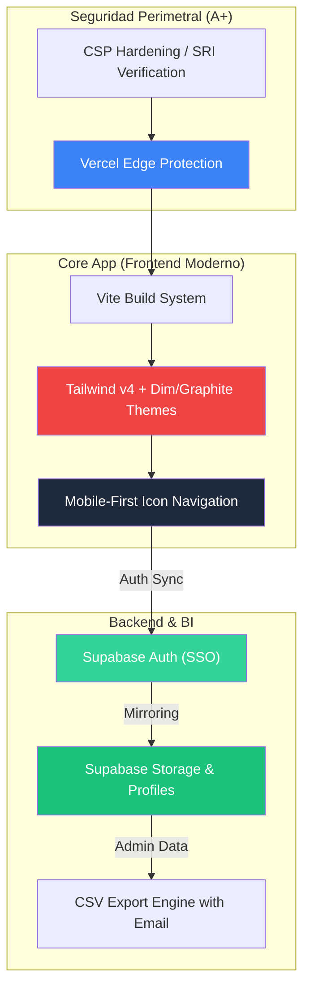

# 🏆 Informe Técnico Ejecutivo Unificado: Prode Mundial 2026

**Fecha de Última Actualización:** 18 de abril de 2026  
**Tipo de Proyecto:** Plataforma de Predicciones Deportivas Corporativa (Vittal Edition) con Módulo de Emergencias Médicas.  
**Estado:** **PRODUCCIÓN FINAL ESTABLE** (Desplegado en [sapate.net.ar](https://sapate.net.ar))  
**Seguridad:** **Grado A+ Confirmado** (Hardening de CSP y SRI completo)

---

## ⏱️ Métricas de Desarrollo Actualizadas (Optimización de UX)
El proyecto ha completado su fase de escalabilidad administrativa y refinamiento de UX, alcanzando su madurez total:

- **Días calendario involucrados:** 20 días (30 de marzo a 18 de abril).
- **Esfuerzo Total Acumulado:** ~56 horas de desarrollo efectivo.
- **Estado de Infraestructura:** 100% Serverless (Vercel + Supabase) sin costes fijos de mantenimiento.

---

## 🚀 Últimas Actualizaciones de Experiencia de Usuario (Abril 18)

### 1. 🌓 Implementación de Modo "Dim" (Grafito)
Se rediseñó el sistema de temas para mejorar el confort visual y la consistencia estética:
- **Equilibrio de Contraste**: Sustitución del "Modo Claro" convencional por un modo **Grafito (Dim)** basado en `slate-800`. Esto elimina el impacto visual brusco al alternar temas y mantiene una identidad visual "pro" en cualquier modo.
- **Transiciones Cinemáticas**: Integración de transiciones CSS `cubic-bezier` de 400ms para suavizar el cambio de luminosidad en el fondo y elementos de UI.
- **Uniformidad Espacial**: Corrección de overrides de fondo en el Fixture, logrando un entorno de juego inmersivo y uniforme en toda la plataforma.

### 2. 🔑 Optimización del Flujo de Autenticación
Se segmentó la experiencia de acceso para agilizar el retorno de usuarios fidelizados:
- **Arquitectura de Pestañas (Tabs)**: Introducción de un selector dinámico entre "Entrar" y "Registrarse".
- **Fricción Mínima**: Los usuarios registrados ahora disponen de un acceso directo solo con **Email**, mientras que los nuevos usuarios acceden al formulario completo de forma bajo demanda.

---

## 🚀 Actualizaciones de la Fase de Escalabilidad (Abril 16)

### 1. 🖥️ Modernización de Navegación de Escritorio
- **Iconografía Minimalista**: Uso de iconos vectoriales para las secciones de Ranking y Usuarios.
- **Consistencia Visual**: Balance entre texto e iconos para facilitar la navegación principal.

### 2. 📊 Gestión de Usuarios y Escalabilidad Administrativa
- **Paginación Inteligente (Virtual Scrolling)**: Visualización por páginas de 15 registros para optimizar el renderizado del admin.
- **Canal de Contacto Directo**: Integración de iconos `mailto:` para comunicación instantánea.

### 3. 📑 Business Intelligence (BI) y Exportación de Datos
- **Exportación con PII (Email)**: Inclusión de correos en reportes CSV.
- **Sincronización Auth-to-Profile**: Integración total de datos entre Auth y perfiles públicos.

---

## 🛠️ Arquitectura de Servicios y Sincronismo

---

## 🏁 Conclusión de Etapa
La plataforma **Prode Mundial 2026** ha evolucionado de un sistema de predicciones a una aplicación corporativa robusta con una **experiencia de usuario (UX) pulida**. Con el nuevo Modo Dim y el flujo de acceso optimizado, el sistema garantiza accesibilidad, velocidad y una estética de vanguardia para todos los colaboradores.

---
*Generado automáticamente por Antigravity AI - 18 de Abril de 2026*
